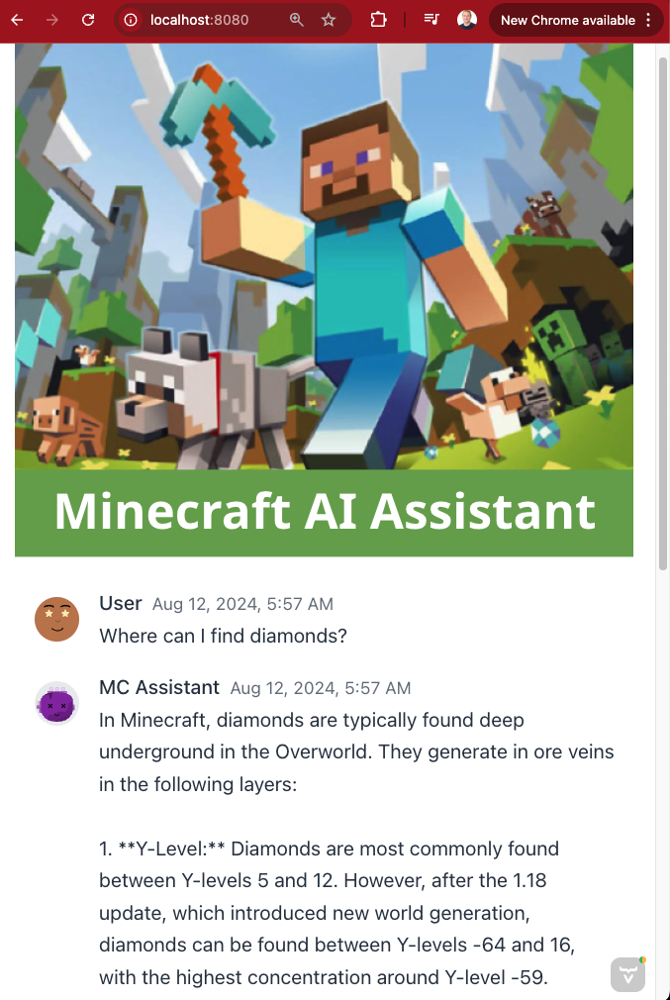

# Minecraft AI Assistant GUI
A GUI layer on top of a Minecraft AI Assistant API service. Intended to be used with https://github.com/aar0np/minecraftAssistant/tree/main .




## Requirements
 - Java 21
 - Maven (dependency management)
 - The (above mentioned) Minecraft Assistant API running via [Uvicorn](https://www.uvicorn.org/).

## To build

```
mvn clean install
```

## To run
First, run the FastAPI service (see above):
```
uvicorn mcwRAGAPI:app
```

Next, run the GUI. It is recommended to run from within an IDE, but it should work with:
```
java -jar target/minecraftai-0.0.1-SNAPSHOT.jar
```
